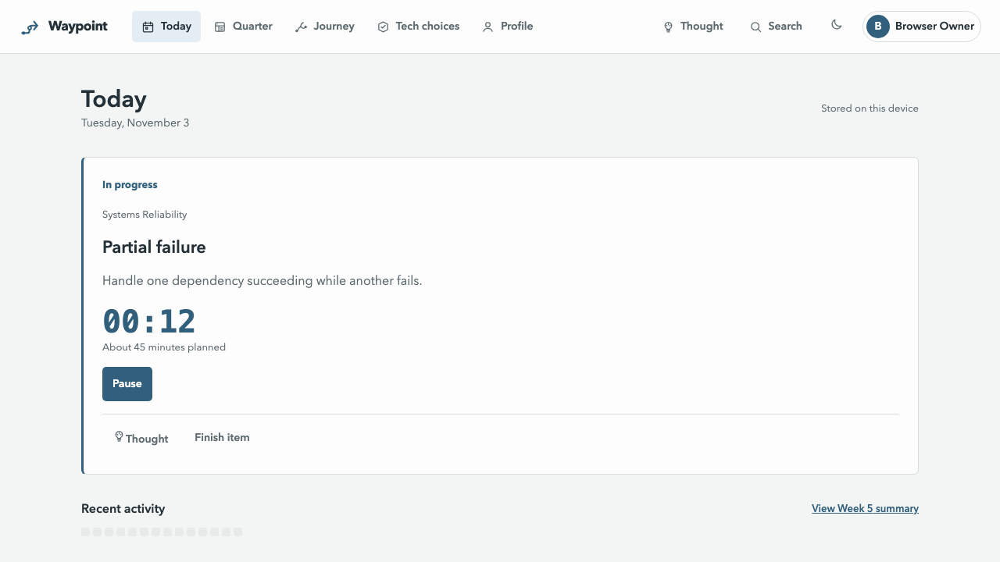
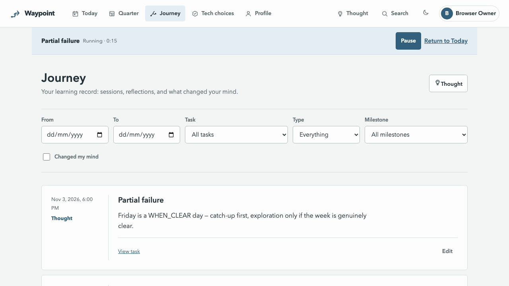
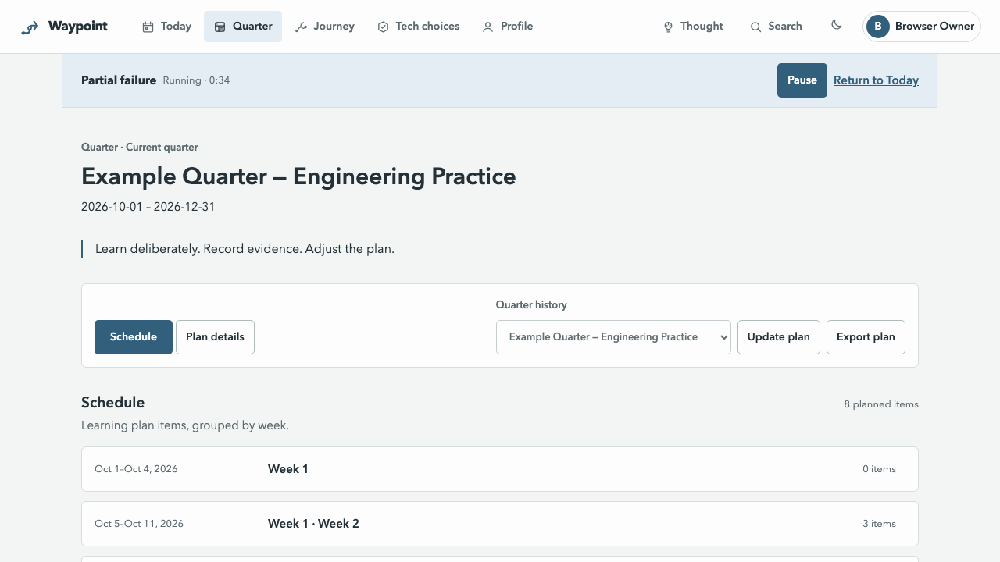

# Waypoint

A private learning log that turns an engineering growth plan into a sustainable daily habit.

> Open → see what matters now → start → learn → pause or finish → leave one small reflection → done.

## A quiet week

> Screenshots from demo data (regenerate with `WAYPOINT_SCREENSHOTS=1 npx playwright test screenshots --project=desktop`). No streaks, scores, or percentages anywhere in this app.







## What this is

- A private learning companion: it already knows the plan, the date, and the latest work state, and offers the next sensible action.
- Tracking is a by-product — sessions create time history, finishing creates progress, reflection creates the learning record. One obvious action per state: Start, Pause, Resume, or Finish.
- Capture first, organize later: a thought needs no category, tag, or link before typing. Reflection is one useful takeaway by default, deeper writing allowed.
- History stays truthful: plan changes affect future work but never rewrite completed learning. Unfinished work and low-energy days are normal states, not failures.

## What it is not

- Not project management, not a habit tracker, not team reporting — one local user with optional invited members, each with private records.
- No streaks, badges, scores, leaderboards, or "you are behind" language. An empty day carries no penalty.
- No cloud sync, notifications, or AI that rewrites plans, records, or reflections.

## The daily loop

1. Open **Today** — the app offers one current learning item, not a backlog to manage.
2. Choose **Start session**, or **Do 10 minutes** on a low-energy day (a normal session intention, not a streak saver).
3. **Pause** when you stop, **Resume** when you return.
4. Choose **Finish item**, pick the honest outcome, optionally leave one useful takeaway.
5. Leave — session time, activity, and Journey history are produced automatically.

The workflow, Quarter preview/export, Journey calendar, and Decisions flow are explained in [Using the app](docs/using-the-app.md).

## Screens

| Screen    | One line                                                                                                                             |
| --------- | ------------------------------------------------------------------------------------------------------------------------------------ |
| Today     | One current learning item with Start / Pause / Resume / Finish and an optional 10-minute session.                                    |
| Quarter   | Current plan intent, success criteria, Focus Areas, Milestones, plus validated plan import preview and YAML export.                  |
| Journey   | Chronological stream of sessions, outcomes, thoughts, and Decision reviews, with a yearly activity calendar and `+ Thought` capture. |
| Decisions | Draft reasoning, accepted read-only choices, and append-only reviews (still holds / adjust / postpone / supersede).                  |
| Search    | Top-bar search across plan work, Journey thoughts, and Decision reasoning, opening each result in its own context.                   |
| Profile   | Account settings and email preferences; owners also create one-time email-bound member invites under Access. |

## Under the hood

- One process: TypeScript Fastify server owns domain behavior and persistence, serves one React SPA, exposes the REST API at `/api`.
- SQLite is authoritative (`SqliteJourneyStore`, no ORM), with FTS5 search prefilter and WAL concurrency.
- Invite-only accounts with scrypt password verifiers, opaque cookie sessions, optional authenticator-app TOTP, and owner/member roles.
- Images are pasted `https://` URL strings only — the server stores the link text and never uploads or fetches image files.
- Email is opt-in via Resend (`WAYPOINT_RESEND_API_KEY` + `WAYPOINT_EMAIL_FROM`); unset means no third-party calls at all.
- Tunnel-ready: the documented public topology is the unmodified container behind an outbound Cloudflare Tunnel on a Pi — no port forwarding.

## Run it

Local development (Node.js 24):

```sh
npm install
npm run auth:bootstrap -- --email you@example.com
npm run dev
```

Open `http://127.0.0.1:5173/register` and paste the one-time invite ID. Optionally add two-factor authentication by scanning the displayed QR code — or entering its manual setup key — and confirming the six-digit code. The invite is bound to that email and expires after seven days. Creating a new bootstrap invite rotates any older unused bootstrap invite.

There is no default user or password. Your login is the email and password you register; Waypoint asks for an authenticator code only if you enabled 2FA.

Production-style local run:

```sh
npm run build
npm start
```

Then open `http://127.0.0.1:4173`. Your data stays on this machine in `data/store`.

### Docker Compose

The published image is `ghcr.io/0x414c49/waypoint:latest`. Copy `.env.example` to `.env` when you want to make the deployment settings discoverable. With `WAYPOINT_DATA_PATH` unset, Docker Compose creates one named volume (`waypoint-data`) mounted at `/app/data`; set it to an absolute host path when a bind mount is preferred:

```sh
docker compose pull
docker compose up -d
docker compose exec waypoint npm run auth:bootstrap:production -- --email you@example.com
```

For a bind mount, set `WAYPOINT_DATA_PATH=/srv/waypoint` (or another host path) in `.env` before `docker compose up -d`. The named volume and bind path contain the same complete backup unit: `store/waypoint.db` and `store/auth.key` (plus the pre-sqlite backup until the migration is verified).

Open the `JOURNEY_PUBLIC_URL` configured in `compose.yaml` (the default is `http://localhost:4173`) and paste the one-time invite at `/register`. Bootstrap is an explicit operator command; it does not run or rotate an invite on container restarts. To use another LAN address, set `WAYPOINT_PUBLIC_URL` in a `.env` file, for example `WAYPOINT_PUBLIC_URL=http://192.168.1.25:4173`, before starting the service. The value must be the exact URL users open. Add exact comma-separated aliases with `WAYPOINT_TRUSTED_HOSTS` and `WAYPOINT_TRUSTED_ORIGINS` when needed; Waypoint never uses a wildcard Host or Origin rule.

For HTTPS behind a reverse proxy, set `WAYPOINT_PUBLIC_URL=https://waypoint.example.com` and either leave `WAYPOINT_SECURE_COOKIES` empty (it is inferred from `https`) or set it to `true`. Terminate TLS at the proxy, preserve the public `Host` and `Origin`, and keep Waypoint private to your LAN or authenticated proxy; this is not a hosted multi-tenant service.

The image supports `linux/amd64` (x86-64, the architecture usually called x86) and `linux/arm64`. True 32-bit `linux/386` is not supported or advertised because the Node.js 24 base image and native ecosystem are not a supported target.

### Unraid

Import [`unraid/waypoint.xml`](unraid/waypoint.xml) into Community Applications, keep the data mapping at `/mnt/user/appdata/waypoint:/app/data`, and set the required `JOURNEY_PUBLIC_URL` field to the exact address users will open (for example `http://192.168.1.25:4173`). The template supplies Docker's non-root `--user=99:100` (Unraid `nobody:users`) so new appdata files use the normal Unraid share ownership. If this directory already exists with different ownership, adjust it once before starting:

```sh
mkdir -p /mnt/user/appdata/waypoint
chown -R 99:100 /mnt/user/appdata/waypoint
```

Open the container console after it starts and run `npm run auth:bootstrap:production -- --email you@example.com`. The template intentionally has no invented logo URL. Stop the container before backing up `/mnt/user/appdata/waypoint` (including `store/waypoint.db` and `store/auth.key`) and restore the complete directory before starting it again. Treat backups as private: they contain password verifiers, encrypted authenticator secrets, the key needed to decrypt them, and all activity.

The Compose file and the template expose only port 4173. The container health check is `/healthz`; it still enforces the configured Host boundary.

## Data & backups

The backup unit is `waypoint.db + auth.key` — back up and restore the whole store directory as one unit while Waypoint is stopped, and never hand-edit store files while the server is running. Backups are private: they hold password verifiers, encrypted authenticator secrets, the key to decrypt them, and all activity.

## Docs map

- Product: [compass](docs/product/product-compass.md) · [UX risk register](docs/product/ux-risk-register.md) · [plan YAML format](docs/product/plan-format-v1.md)
- Journeys: [core journeys](docs/journeys/core-journeys.md) · [ASCII wireframes](docs/journeys/ascii-wireframes.md) · [confirmed interaction model](docs/journeys/confirmed-interaction-model.md) · [UX evaluation](docs/journeys/ux-evaluation.md)
- Design: [visual system](docs/design/visual-system.md) · [information architecture](docs/design/information-architecture.md) · [design review](docs/design/design-review.md)
- Architecture: [system design](docs/architecture/system-design.md) · [technology stack](docs/architecture/technology-stack.md) · [architecture review](docs/architecture/architecture-review.md) · [domain model](docs/architecture/domain-model.md) · [domain review](docs/architecture/domain-model-review.md) · [task lifecycle](docs/architecture/task-lifecycle.md) · [plan & history](docs/architecture/plan-and-history.md) · [API contract](docs/architecture/api-contract.md) · [dashboard contract](docs/architecture/dashboard-contract.md) · [error & conflict contract](docs/architecture/error-contract.md) · [persistence contract](docs/architecture/persistence-contract.md) · [API & persistence review](docs/architecture/api-review.md) · [auth](docs/architecture/authentication-and-authorization.md)
- Decisions: [ADRs](docs/adr/README.md) — SQLite+FTS store · URL-only images · Pi Tunnel deployment · opt-in Resend email
- Planning: [stages & gates](planning/stages-and-gates.md) · [release scope](planning/release-scope.md) · [validation plan](planning/validation-plan.md) · [implementation gate](planning/implementation-gate.md) · [final A/B audit](planning/final-gate-audit.md) · [working agreement](planning/working-agreement.md)
- Evidence: [slice 0](planning/slice-0-validation.md) · [slice 1](planning/slice-1-validation.md) · [slice 2](planning/slice-2-validation.md) · [slice 3 map](planning/slice-3-implementation-map.md) · [slice 3](planning/slice-3-validation.md) · [slice 4 map](planning/slice-4-implementation-map.md) · [slice 4](planning/slice-4-validation.md) · [slice 5 map](planning/slice-5-implementation-map.md) · [slice 5](planning/slice-5-validation.md)
- Start here: [Using the app](docs/using-the-app.md)

## Working rule

Each stage must leave a written decision behind. Later work must cite those decisions, and any change to a confirmed decision must be recorded in [the decision log](planning/decision-log.md).
